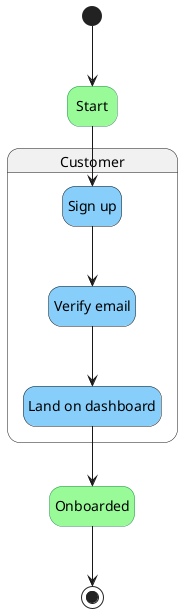

# BPMN Process Design

Owns the **business-process layer** of the shared design model defined by the [`design-model`](../design-model/SKILL.md) foundation skill. Reads and writes one section of one file, and writes one diagram per process:

- **Reads / writes**: `designs/system-model.yaml` → `processes[]`
- **Emits**: `designs/diagrams/process-<process-id>.puml` (one PlantUML file per process)

This skill never executes a process, never integrates with Camunda/Zeebe/Activiti, and never produces BPMN 2.0 XML. The diagrams are documentation a human reads while talking to stakeholders, not artefacts a workflow engine runs.

## When to load this skill

- The user asks to add, edit, or visualise a business process, lane, task, gateway, event, or sequence flow.
- The user mentions BPMN, business process, process model/diagram, swimlane, workflow diagram, or asks to "walk through" a sequence of business steps.
- A diagram of a specific process needs to be regenerated after a model change.
- A cross-link report is needed (orphan tasks with no `implementedBy`, processes disconnected from the system layer).

Load the [`design-model`](../design-model/SKILL.md) foundation skill alongside this one whenever the model file does not yet exist or its ID grammar is in question.

## Prerequisites

The generator script dynamic-imports the `yaml` package. If it is not available in the workspace:

```bash
pnpm add -D -w yaml
```

Or pass `--json` and a JSON model file — the same fallback used by the foundation validator and the ERD generator.

## Workflow

### 1. Make sure the model file exists

If `designs/system-model.yaml` is missing, hand off to `design-model` to bootstrap it. Do not invent a new file format.

### 2. Add or edit a process

Walk the user through one process at a time:

1. **Process name** — short imperative phrase (`Place Order`, `Approve Expense`, `Onboard Customer`).
2. **ID** — `process:<kebab-case>`, optionally namespaced (`process:checkout/place-order`).
3. **Description** — one sentence on the business outcome.
4. **Pools and lanes** — one pool per organisation/system that participates; one lane per role inside that pool. Each lane optionally references an `actor:` from the foundation actors registry.
5. **Tasks** — for each task: name, the lane it sits in, optional `implementedBy: [function:…]` linking to the system-design layer, optional `consumes: [entity:…]` and `produces: [entity:…]`.
6. **Gateways** — type is one of `exclusive`, `parallel`, `inclusive`. Name them as questions (`"Stock available?"`) for exclusive/inclusive, as labels (`"split work"`) for parallel.
7. **Events** — at least one `start` and one `end`. Optional intermediate events for waits (timer, message).
8. **Sequence flows** — `from` → `to`, where both endpoints are events, tasks, or gateways. Optional `condition` label (rendered as the arrow label, useful on exclusive-gateway branches).

Keep IDs stable. Renaming a task ID requires updating every flow that references it; the foundation validator catches dangling references.

### 3. Validate the model

```bash
node .agents/skills/design-model/scripts/validate.mjs designs/system-model.yaml
```

The foundation validator covers:

- ID uniqueness and grammar.
- Lane → actor references resolve.
- Flow endpoint references resolve and point at events / tasks / gateways (not lanes or pools).
- Task cross-references (`implementedBy`, `consumes`, `produces`) resolve to existing functions / entities.

Fix any errors it reports before regenerating.

### 4. Regenerate the diagram(s)

```bash
node .agents/skills/bpmn-design/scripts/generate.mjs designs/system-model.yaml
```

The generator writes one file per process. It always overwrites — never hand-edit `process-*.puml` files. Tweaks belong in the model (rename, regroup, add description) and the generator re-emits them.

To regenerate just one process:

```bash
node .agents/skills/bpmn-design/scripts/generate.mjs designs/system-model.yaml --process process:checkout
```

### 5. Read the validation report

After generation the script prints, per process:

- A one-line summary: `process:checkout — 2 actors · 3 lanes · 5 tasks · 2 gateways (1 exclusive, 1 parallel) · 1 starts, 1 ends · 7 flows` (actor count = unique `actor:` IDs referenced by lanes in the process).
- Orphan tasks: tasks with no `implementedBy` reference.
- Disconnected processes: processes where every task has empty `implementedBy` (no link from the business layer to the code layer at all).
- Unresolved `implementedBy` references: tasks pointing at function IDs that do not exist in `model.functions[]`. Surfaced here as warnings so per-process generation stays useful during incremental modelling; the foundation validator hard-fails on the same condition.
- Cross-layer warnings: tasks whose `implementedBy` mixes services from different modules (a smell — the process is straddling module boundaries the architect should examine).

Other foundation-layer issues (ID grammar, wrong-kind references, dangling flow endpoints, unresolved entity / lane / actor references) are reported by the foundation validator, not duplicated here.

## Process object shape

```yaml
processes:
  - id: process:checkout                  # required, must start with "process:"
    name: Checkout                        # required, display label
    description: Customer places an order. # optional, one sentence
    kpis:                                 # optional free-text list, design discussion only
      - "Order placement < 30 s p95"
      - "Cart abandonment < 25%"
    businessRules:                        # optional free-text list
      - "Out-of-stock items cannot be placed"

    pools:                                # required, at least one
      - id: pool:checkout-customer
        name: Customer
        lanes:
          - id: lane:browser              # required
            name: Browser                 # required
            actor: actor:Customer         # optional, link to actors[]

    events:                               # required, at least one start and one end
      - id: event:checkout-start
        name: Browse begins
        type: start                       # start | intermediate | end
        lane: lane:browser
      - id: event:checkout-placed
        name: Order placed
        type: end
        lane: lane:order-service

    tasks:                                # required (almost always)
      - id: task:add-to-cart
        name: Add to cart
        lane: lane:browser
        implementedBy: [function:CartService.addItem]  # optional, links to system layer
        consumes: [entity:Product]                     # optional, links to data layer
        produces: [entity:CartItem]                    # optional, links to data layer
        description: Customer adds a product to cart.  # optional

    gateways:                             # optional
      - id: gateway:stock-available
        name: Stock available?
        type: exclusive                   # exclusive | parallel | inclusive
        lane: lane:order-service

    flows:                                # required, ties everything together
      - from: event:checkout-start
        to: task:add-to-cart
      - from: task:add-to-cart
        to: gateway:stock-available
      - from: gateway:stock-available
        to: task:reserve-inventory
        condition: "in stock"             # optional label rendered on the arrow
      - from: gateway:stock-available
        to: task:notify-out-of-stock
        condition: "out of stock"
```

### Required vs optional

- **Required**: `id`, `name`, at least one `pools[]` with at least one `lanes[]`, at least one `event` of type `start`, at least one `event` of type `end`, `flows[]` connecting the graph.
- **Optional**: `description`, `kpis`, `businessRules`; tasks may declare zero `implementedBy` references during early modelling but the report flags them.

The foundation validator enforces ID grammar, lane references, and flow-endpoint kinds. Layer-specific checks (≥1 start event, ≥1 end event, every node reachable from a start) are reported by this skill's generator as warnings.

## PlantUML BPMN examples

PlantUML does not have first-class BPMN, so this skill renders processes as **state diagrams** with composite-state swimlanes and stereotype-based shapes. The output renders cleanly in any PlantUML installation, GitHub-flavoured Markdown that supports PlantUML, and VS Code PlantUML extensions.

### Sequential happy path (one lane, no gateway)



### Exclusive-gateway branch ("XOR")

```plantuml
state "Stock available?" as g_stock <<gateway>>

t_place --> g_stock
g_stock --> t_reserve : "in stock"
g_stock --> t_notify  : "out of stock"
t_reserve --> e_placed
t_notify  --> e_aborted
```

The condition strings come from `flows[].condition`. Always label both branches of an exclusive gateway — an unlabelled branch is a modelling smell.

### Parallel-gateway split / join ("AND")

```plantuml
state "Split work"  as g_split <<gateway>>
state "Join work"   as g_join  <<gateway>>

t_received --> g_split
g_split --> t_chargeCard
g_split --> t_reserveStock
t_chargeCard   --> g_join
t_reserveStock --> g_join
g_join --> t_confirm
```

Use `name`s like `"Split work"` / `"Join work"` for parallel gateways — they don't ask a question, they coordinate parallel paths.

### Multi-lane swimlane

```plantuml
state "Customer" as lane_customer {
  state "Browse"    as t_browse <<task>>
  state "Add to cart" as t_cart <<task>>
}
state "Order Service" as lane_order {
  state "Place order"     as t_place <<task>>
  state "Reserve stock"   as t_reserve <<task>>
}
state "Payment Provider" as lane_pay {
  state "Charge card"     as t_charge <<task>>
}

t_browse  --> t_cart
t_cart    --> t_place
t_place   --> t_reserve
t_reserve --> t_charge
```

Each `pool` becomes its own composite state in the diagram and reads as a swimlane in the rendered output.

### Inclusive gateway ("OR")

```plantuml
state "Notify channels" as g_chan <<gateway>>

t_orderPlaced --> g_chan
g_chan --> t_emailReceipt : "email enabled"
g_chan --> t_smsReceipt   : "SMS enabled"
g_chan --> t_pushReceipt  : "push enabled"
```

Inclusive gateways may activate any non-empty subset of branches. Always label every branch with the condition that selects it.

## Generator behaviour

`scripts/generate.mjs` reads `designs/system-model.yaml` and writes one file per process to `designs/diagrams/process-<slug>.puml`, where `<slug>` is the process ID with the `process:` prefix removed and `/` replaced with `_`.

It also:

- Prints a per-process summary line: `<id> — N lanes · N tasks · N gateways (kinds) · N starts, N ends · N flows`.
- Warns if a process has zero `start` events or zero `end` events.
- Warns if a process has tasks with no `implementedBy` reference (orphan tasks at the BPMN layer).
- Warns if every task in the process has empty `implementedBy` (the process is entirely disconnected from the system layer — it may be intentional during discovery, or it may indicate stale modelling).
- Warns if a process's `implementedBy` references span multiple modules (the architect should check whether the process is genuinely cross-cutting or whether the modules need restructuring).
- Skips dangling flow endpoints with a warning (foundation validator hard-fails on these; this script stays useful for standalone runs).
- Exits non-zero only on internal failures (unparseable YAML, missing `processes[]` section); zero on warnings.

## Bundled files

```
.agents/skills/bpmn-design/
├── SKILL.md                 ← you are here
├── scripts/
│   └── generate.mjs         ← processes[] → one PlantUML file per process
└── references/
    └── bpmn-elements.md     ← long-form notes on BPMN element semantics
```
