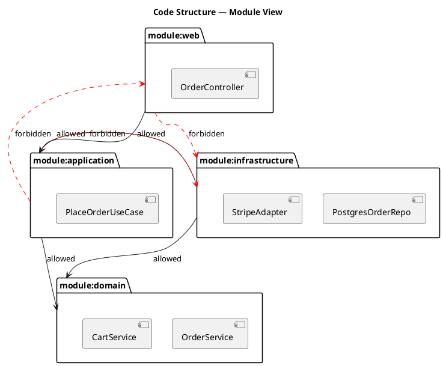
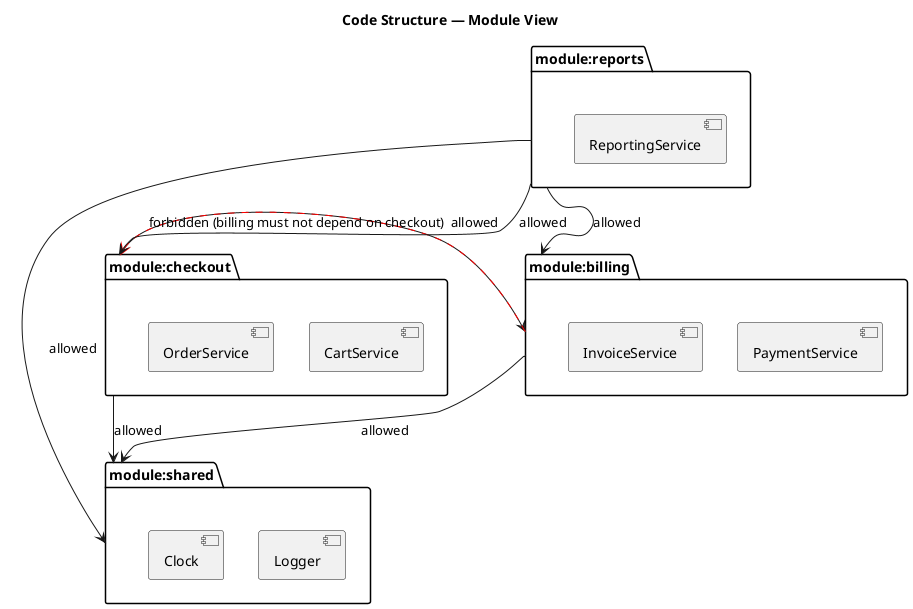

# Code Structure Design (Modules, Dependencies, Compare-against-Repo)

Owns the **code-organisation layer** of the shared design model defined by the [`design-model`](../design-model/SKILL.md) foundation skill. Reads and writes one section of one file, and writes one diagram:

- **Reads / writes**: `designs/system-model.yaml` → `modules[]`
- **Emits**: `designs/diagrams/code-structure.puml` — one package diagram for the whole codebase blueprint.
- **Read-only mode**: `--compare-repo <root>` diffs the design against an actual source tree.

This skill never creates folders, files, or scaffold code, and it never lints actual imports. The output is a **blueprint** — a target shape the user can build toward, or check an existing repo against. It is intentionally style-agnostic: the same primitives express layered, feature-sliced, hexagonal, and bounded-context layouts; the architectural opinion belongs to the architect, not the skill.

## When to load this skill

- The user asks to add, edit, or visualise a module, package, folder, or codebase layout.
- The user mentions code structure, folder structure, module boundaries, package design, layered architecture layout, feature-sliced architecture, or "design the codebase layout".
- The user asks "where should this service live" or "show me how my code is organised".
- The user wants to diff their actual folders against the design (`--compare-repo`).
- A code-structure diagram needs to be regenerated after a model change.

Load the [`design-model`](../design-model/SKILL.md) foundation skill alongside this one whenever the model file does not yet exist or its ID grammar is in question. Load [`system-design`](../system-design/SKILL.md) when the modules' `contains[]` field needs a `service:` ID that hasn't been declared yet. Load [`architecture-patterns`](../architecture-patterns/SKILL.md) when the user wants opinionated guidance on a particular style (Clean, Hexagonal, DDD bounded contexts).

## Prerequisites

The generator script dynamic-imports the `yaml` package. If it is not available in the workspace:

```bash
pnpm add -D -w yaml
```

Or pass `--json` and a JSON model file — the same fallback used by the foundation validator and the sibling generators.

## Workflow

### 1. Make sure the model file exists

If `designs/system-model.yaml` is missing, hand off to `design-model` to bootstrap it. Do not invent a new file format.

### 2. Add or edit a module

Walk the user through one module at a time:

1. **Module name** — short noun phrase (`Domain`, `Application`, `Checkout`, `BillingApi`).
2. **ID** — `module:<kebab>` (`module:domain`, `module:checkout`, `module:billing-api`). Nested IDs are allowed and use `/` (`module:checkout/orders`); the foundation validator enforces the grammar.
3. **Intended folder path** — advisory string indicating where the module should live in source (`src/domain`, `packages/checkout`). Not validated against the filesystem unless `--compare-repo` is used.
4. **Contains** — list of `service:<id>` IDs from the system-design layer that physically live inside this module. Foundation validator hard-fails if a service ID does not exist.
5. **Allowed dependencies** — list of `module:<id>` IDs this module is allowed to import / depend on. Drives the solid arrows in the diagram and the cycle check.
6. **Forbidden dependencies** — *optional* list of `module:<id>` IDs that must never be imported from this module. Drives the red dashed arrows in the diagram and the contradiction check (a module declared as both allowed and forbidden is reported as an error by this skill).
7. **Description** — one sentence on the module's responsibility.

The same module can act as a "layer" in a layered design (`module:domain`, `module:application`, `module:infrastructure`) or as a "feature slice" (`module:checkout`, `module:billing`, `module:reports`). The skill does not care which — pick the metaphor that fits your codebase.

### 3. Validate the model

```bash
node .agents/skills/design-model/scripts/validate.mjs designs/system-model.yaml
```

The foundation validator covers:

- ID uniqueness and grammar (`module:` allows `[a-z][a-z0-9-]*` segments separated by `/`, e.g. `module:checkout/orders`).
- `modules[].contains[]` resolves to `service:` IDs.
- `modules[].allowedDependencies[]` resolves to `module:` IDs.
- `modules[].forbiddenDependencies[]` resolves to `module:` IDs.
- `modules[].deployedTo[]` resolves to `node:` IDs (owned by the EA orchestrator).

Fix any errors it reports before regenerating.

### 4. Regenerate the diagram

```bash
node .agents/skills/code-structure-design/scripts/generate.mjs designs/system-model.yaml
```

Always overwrites — never hand-edit `code-structure.puml`.

### 5. Read the validation report

After generation the script prints:

- A one-line summary: `code-structure — N modules · K services placed · A allowed-dep edges · F forbidden-dep edges`.
- **Cycles**: every cycle in the `allowedDependencies` graph, printed with the full cycle path (`module:a → module:b → module:c → module:a`). Cycles are usually a real architectural issue — fix or break the cycle deliberately.
- **Allowed/forbidden contradiction**: a module ID listed in *both* `allowedDependencies` and `forbiddenDependencies` of the same module. Reported as an error — the model is internally inconsistent.
- **Empty modules**: modules with no `contains[]` entries — typically a placeholder you forgot to fill in.
- **Unplaced services**: every `service:` ID in `services[]` that does not appear in any module's `contains[]`. Cross-layer warning — most services should live in a module, especially if the EA layer wants to deploy them.
- **Duplicate folder paths**: two modules with the same `intendedFolderPath` — likely a copy-paste bug.

The script exits 0 on warnings and on cycle reports; non-zero only on internal failures (unparseable file, missing `modules[]`) or on the allowed/forbidden contradiction error.

### 6. Optional: compare the design against a real repo

```bash
node .agents/skills/code-structure-design/scripts/generate.mjs designs/system-model.yaml --compare-repo <root>
```

Pure read; never writes files (apart from the diagram, which is regenerated as a side-effect of the same run unless `--no-diagram` is passed).

The compare report prints:

- **Modules without a folder**: design declares `intendedFolderPath` but the path doesn't exist under `<root>`.
- **Folders without a module**: folders under `<root>/src` and under workspace-style dirs (`packages`, `apps`, `artifacts`), scanned **two levels deep** in each (so both `packages/checkout` and `packages/checkout/src` are considered), that no module's `intendedFolderPath` matches.
- A small **skip-list** is applied to repo scanning: `.git`, `node_modules`, `dist`, `build`, `.next`, `.turbo`, `.cache`, `coverage`, `.local`. Document any project-specific noise folders you want to ignore by adding the flag `--skip <name>` (repeatable).

The compare mode is read-only by design — it never edits the model. Use the report as a checklist to either reorganise the repo, or to update the design's `intendedFolderPath` values.

## Object shape

```yaml
modules:
  - id: module:domain                       # required, "module:<kebab>" or nested with "/"
    name: Domain                            # required
    intendedFolderPath: src/domain          # optional, advisory only
    description: Pure business model.       # optional
    contains:                               # optional, → service[]
      - service:OrderService
      - service:CartService
    allowedDependencies: []                 # optional, → module[] — innermost layer depends on nothing
    forbiddenDependencies:                  # optional, → module[]
      - module:infrastructure
    deployedTo: []                          # optional, → node[] — owned by EA orchestrator

  - id: module:application
    name: Application
    intendedFolderPath: src/application
    contains: [service:PlaceOrderUseCase]
    allowedDependencies: [module:domain]
    forbiddenDependencies: [module:infrastructure, module:web]

  - id: module:infrastructure
    name: Infrastructure
    intendedFolderPath: src/infrastructure
    contains: [service:PostgresOrderRepo, service:StripeAdapter]
    allowedDependencies: [module:domain, module:application]
    forbiddenDependencies: []

  - id: module:web
    name: Web (HTTP delivery)
    intendedFolderPath: src/web
    contains: [service:OrderController]
    allowedDependencies: [module:application]
    forbiddenDependencies: [module:infrastructure]
```

### Required vs optional

- **module**: `id`, `name` required; everything else optional. A module with no `contains[]` is a placeholder; the validator surfaces it.

## PlantUML examples

### Layered layout

The classic 4-layer "Clean / Onion / Hexagonal" arrangement: `domain ← application ← infrastructure / web`.



### Feature-sliced layout

Each top-level module is a vertical slice (`checkout`, `billing`, `reports`); a thin shared kernel holds cross-cutting code.



### Nested module IDs

The validator allows `module:checkout/orders`. The current generator renders nested IDs as **flat packages with a slash in the label**, not as nested PlantUML `package { package { } }`. Reason: the slash in the ID is a naming hint, not a guarantee of physical nesting (the parent might not exist as its own module). Treating them flat avoids drawing parents that aren't declared.

If your design genuinely has nested modules, declare both the parent (`module:checkout`) and the child (`module:checkout/orders`) and let `intendedFolderPath` carry the nesting (`src/checkout`, `src/checkout/orders`).

## Compare-against-repo example

```text
$ node .agents/skills/code-structure-design/scripts/generate.mjs designs/system-model.yaml --compare-repo .
Wrote designs/diagrams/code-structure.puml

Summary:
  • code-structure — 4 modules · 6 services placed · 4 allowed-dep edges · 3 forbidden-dep edges

Repo comparison (root: .):
  Modules without a folder:
    • module:reports → designs say src/reports — folder not found
  Folders without a module:
    • src/legacy           (no module's intendedFolderPath matches)
    • src/scripts          (no module's intendedFolderPath matches)
  Skipped (build / cache / vcs):
    .git, node_modules, dist, .turbo, coverage
```

The report is a reconciliation checklist. There are three valid responses to each line:

- **Update the design** — add a missing module or fix the `intendedFolderPath`.
- **Update the repo** — move folders so the layout matches the design.
- **Add the folder to the skip-list** — for legitimate non-design folders (`scripts`, `migrations`, `tooling`).

## Generator behaviour

`scripts/generate.mjs` reads `designs/system-model.yaml` and writes:

- `designs/diagrams/code-structure.puml` — one PlantUML package diagram with all modules, their contained services, allowed dependencies (solid black arrows), and forbidden dependencies (red dashed arrows).

It also:

- Detects cycles in the `allowedDependencies` graph and prints the full cycle path.
- Reports allowed/forbidden contradictions as errors (exits non-zero).
- Warns about empty modules, unplaced services, unknown service IDs in `contains[]`, and duplicate `intendedFolderPath` values.
- In `--compare-repo <root>` mode: walks `<root>/src` and the workspace-style dirs (`packages`, `apps`, `artifacts`) two levels deep, and reports modules without a folder + folders without a module. Read-only.
- Skips edges whose endpoints don't resolve (foundation validator hard-fails on those; this script stays useful when you want to regenerate a partially-edited model).
- Exits 0 on warnings and on cycle reports; non-zero on internal failures (unparseable YAML, missing `modules[]` section) or on allowed/forbidden contradictions.

### Flags

| Flag | Purpose |
|------|---------|
| `--json` | Treat the input as JSON instead of YAML. |
| `--compare-repo <root>` | Run the read-only repo-comparison report against `<root>`. |
| `--skip <name>` | Add a folder name to the repo-scan skip-list (repeatable). |
| `--no-diagram` | Skip writing `code-structure.puml` (only useful with `--compare-repo` when you just want the report). |

## Bundled files

```
.agents/skills/code-structure-design/
├── SKILL.md                      ← you are here
├── scripts/
│   └── generate.mjs              ← modules → code-structure.puml + cycle/contradiction report + compare-repo
└── references/
    └── module-patterns.md        ← long-form notes on layered vs feature-sliced patterns, cycle detection rationale, intentional limitations
```
