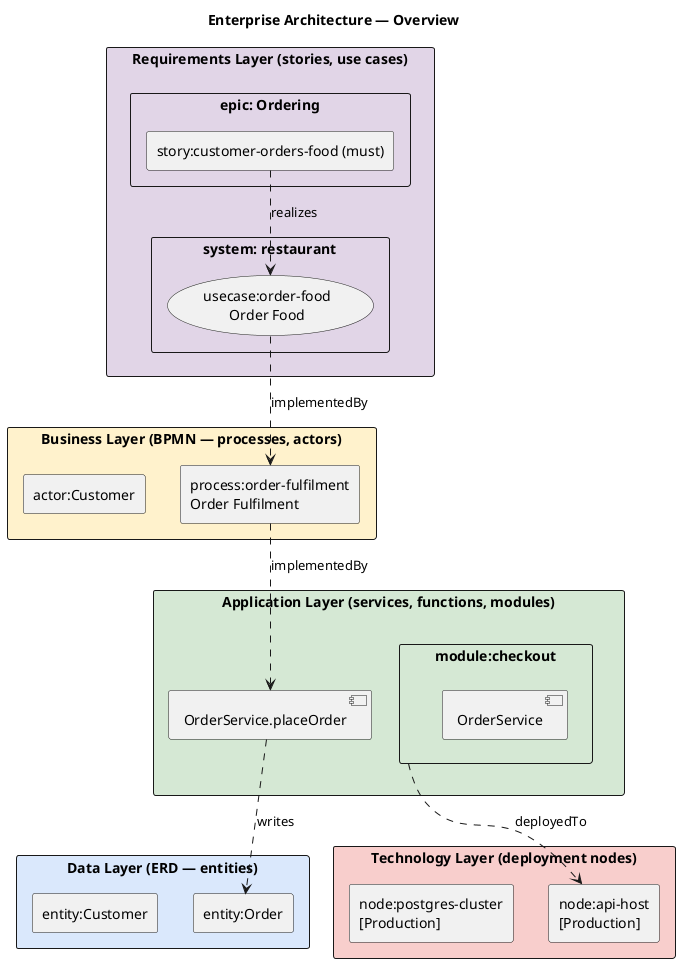

# Enterprise Architecture Orchestrator (Requirements → Business → Data → Application → Technology)

The capstone skill on top of the [`design-model`](../design-model/SKILL.md) foundation. Composes the slices owned by the six sibling layer-skills and adds the **technology** layer (deployment nodes, environments, runtime platforms) it owns directly. Produces two artifacts:

- **Layered overview diagram** — `designs/diagrams/ea-overview.puml`. A single PlantUML picture with all five layers stacked top-to-bottom, populated with the actual story / use case / process / entity / service / module / node IDs from the model, with cross-layer arrows showing the realizes / implementedBy / reads-writes / deployedTo relationships.
- **Traceability report** — `designs/ea-traceability.md`. A markdown document with one section per business process. Each section opens with a **Requirements** subsection that lists the stories and use cases that trace down into the process, then walks down through the stack: tasks → functions → entities (read/written) → services → modules → deployment nodes. Every gap in the trace is named with exact IDs (`process:order-fulfilment / task:pay — NO IMPLEMENTING FUNCTIONS DECLARED`).

This is the only skill that reads from every layer at once. The six focused skills (`user-story-design`, `use-case-design`, `bpmn-design`, `erd-design`, `system-design`, `code-structure-design`) each remain triggerable on their own and do not require the orchestrator. The orchestrator never edits the layer-owned sections — the sibling skills own those.

## When to load this skill

- The user mentions enterprise architecture, EA, TOGAF, ArchiMate, end-to-end design, architecture overview, traceability, or business-to-technology mapping.
- The user asks "where does this story land in the code", "which use case does this function realize", "where does this process land in the code", "which deployment node runs this function", or "show me a single picture of the whole architecture".
- The user wants to add, edit, or visualise deployment nodes / environments / runtime platforms.
- A cross-layer change has happened (e.g. a new process was added) and you need to refresh the overview and the trace report.

Load the [`design-model`](../design-model/SKILL.md) foundation skill alongside this one whenever the model file does not exist yet. Load any sibling layer-skill when the user wants to *edit* one specific layer (the orchestrator does not edit those sections — it only reads them).

## TOGAF / ArchiMate layer mapping

| TOGAF Phase | ArchiMate Layer | Owned by sibling skill | Model section |
|-------------|-----------------|------------------------|---------------|
| Preliminary / Phase A — Architecture Vision | Motivation Layer (drivers, goals, requirements) | [`user-story-design`](../user-story-design/SKILL.md) + [`use-case-design`](../use-case-design/SKILL.md) | `stories[]`, `usecases[]` |
| Phase B — Business Architecture | Business Layer (processes, actors, business functions) | [`bpmn-design`](../bpmn-design/SKILL.md) | `processes[]`, `actors[]` |
| Phase C — Data Architecture | Information Layer (data objects) | [`erd-design`](../erd-design/SKILL.md) | `entities[]` |
| Phase C — Application Architecture | Application Layer (application services, components, functions) | [`system-design`](../system-design/SKILL.md) + [`code-structure-design`](../code-structure-design/SKILL.md) | `services[]`, `functions[]`, `flows[]`, `modules[]` |
| Phase D — Technology Architecture | Technology Layer (nodes, system software) | **this skill** | `technology.nodes[]`, `technology.environments[]`, `technology.runtimes[]` |

For the long-form rationale (why split application across two skills, why "design-only", why the TOGAF/ArchiMate framing matters in practice), see [references/togaf-archimate-mapping.md](references/togaf-archimate-mapping.md).

## Workflow

### 1. Make sure the model file exists

If `designs/system-model.yaml` is missing, hand off to `design-model` to bootstrap it. The orchestrator never invents the file format.

### 2. Add or edit the technology layer

Walk the user through one node at a time:

1. **Node name** — short noun phrase (`Web Host`, `Postgres Cluster`, `Stripe`).
2. **ID** — `node:<kebab>` (`node:web-host`, `node:postgres-cluster`, `node:stripe`).
3. **Kind** — one of `container`, `vm`, `serverless`, `host`, `edge`, `managed-service`, `external`, `other`. Free string; the validator does not constrain it.
4. **Runtime / provider / region** — optional, free-text fields used as labels in the diagram.
5. **Hosts** — optional `node:` IDs of child nodes (a Kubernetes cluster can host multiple pods, etc.).
6. **Description** — one sentence on the node's role.

Then optionally group nodes into environments (Production, Staging, Dev) and document runtime platforms (Node.js 20, Python 3.12, Postgres 15) for reference.

### 3. Wire modules to nodes

Modules are deployed to nodes via `modules[].deployedTo[]` (owned by `code-structure-design`, validated by the foundation). Edit the module entries — *not* the node entries — to declare deployment.

### 4. Validate the model

```bash
node .agents/skills/design-model/scripts/validate.mjs designs/system-model.yaml
```

The foundation validator covers ID grammar and cross-reference resolution for every layer. Fix any errors before regenerating.

### 5. Regenerate the overview diagram and the traceability report

```bash
node .agents/skills/enterprise-architecture/scripts/generate.mjs designs/system-model.yaml
```

This always overwrites `designs/diagrams/ea-overview.puml` and `designs/ea-traceability.md`. Optional `--render-all` also re-runs every sibling generator (user-story, use-case, BPMN, ERD, system, code-structure) so all layer diagrams refresh in one shot.

### 6. Read the cross-layer gap report

After generation the script prints the full gap list — every place a trace breaks. Categories:

- **Process tasks without an implementing function** — `process:X / task:Y — NO IMPLEMENTING FUNCTIONS DECLARED`
- **Functions without an owning service** — `function:X.y — no service` (the foundation already requires `function.service`, so this typically only fires when a function entry was hand-edited)
- **Services not placed in any module** — `service:X — not contained by any module` (also reported by `code-structure-design`; surfaced here too because it breaks the trace)
- **Modules without a deployment node** — `module:X — no deployedTo[] declared`
- **Processes with no tasks** — `process:X — no tasks declared`
- **Nodes referenced by no module** — `node:X — no module deploys to it` (informational only — does not count toward the `--strict` exit-1 total; a node may exist for documentation reasons, e.g. external services)
- **Stories that realize no use case** — `story:X — no realizes[] declared` (informational only — sometimes intentional, e.g. pure-plumbing stories; usually a sign the use-case layer has not caught up)
- **Use cases not realized by any story** — `usecase:X — no story realizes it` (informational only — fine for early-stage use cases; suspicious once delivery has started)

Functions that don't touch any entities are not flagged — many service functions legitimately have no `reads[]`/`writes[]` (HTTP shims, no-op endpoints, etc.).

Exit codes: 0 on success (warnings are OK); 1 when `--strict` was passed AND the report has at least one **non-informational** gap (informational categories — orphan nodes, stories without use cases, use cases without stories — are reported but never count toward the strict total); 2 on internal failures.

## Technology section — object shape

```yaml
technology:
  nodes:                                  # required (foundation walks this list)
    - id: node:web-host                   # required, "node:<kebab>"
      name: Web Host                      # required
      kind: container                     # optional, free string (container/vm/serverless/host/edge/managed-service/external/other)
      runtime: nodejs-20                  # optional, free string — diagram label
      provider: aws                       # optional, free string — diagram label
      region: us-east-1                   # optional, free string — diagram label
      description: Stateless API container.
      hosts: []                           # optional, → node[] — child nodes
    - id: node:postgres-cluster
      name: Postgres Cluster
      kind: managed-service
      runtime: postgres-15
      provider: aws
      region: us-east-1
    - id: node:stripe
      name: Stripe
      kind: external
      description: Third-party payment provider.

  environments:                           # optional — soft groupings, no IDs
    - name: Production
      nodes: [node:web-host, node:postgres-cluster, node:stripe]
    - name: Staging
      nodes: [node:web-host, node:postgres-cluster]

  runtimes:                               # optional — purely descriptive, no IDs
    - name: Node.js 20 LTS
      usedBy: [node:web-host]
    - name: PostgreSQL 15
      usedBy: [node:postgres-cluster]
```

`environments[]` and `runtimes[]` are documentation aids — they have no IDs and the foundation validator does not cross-check them. The orchestrator uses `environments[]` as colour-bands in the overview diagram and as parenthesised tags in the traceability report.

## Layered overview diagram convention

The overview is **one** diagram with **five** stacked layers. Each layer is rendered as a coloured rectangle containing the IDs from that layer:



Conventions:

- One node per ID; aliases are kind-prefixed (`story_`, `uc_`, `proc_`, `actor_`, `ent_`, `mod_`, `svc_`, `fn_`, `node_`) and sanitised to be PlantUML-safe.
- **Nesting in the Requirements layer**: stories sit inside an `epic: <label>` rectangle (one per distinct `epic`, plus "Unassigned" for stories with no epic); use cases sit inside a `system: <label>` rectangle (one per distinct `system`, plus "(ungrouped)" for use cases with no system).
- **Nesting in the Application layer**: `service` components render inside their `module` rectangle; functions float in the application layer because a function belongs to a service that belongs to a module — three levels of nesting clutters the diagram more than it clarifies.
- **Cross-layer arrows** use the dotted style (`..>`) to distinguish them from intra-layer arrows in the per-layer diagrams (which use `->` and `-->`). Labels: `realizes`, `implementedBy`, `reads`, `writes`, `deployedTo`. The `usecase --> process` `implementedBy` arrow is computed transitively — drawn when at least one story that realizes the use case shares an `implementedBy` function with one of the process's tasks.
- The diagram is necessarily a simplification — for the full per-layer detail, refer to the six sibling diagrams (`stories.md`, `usecase-*.puml`, `process-*.puml`, `erd.puml`, `system-c4.puml`, `code-structure.puml`).

## Traceability report convention

`designs/ea-traceability.md` has one section per process, each walking the stack:

```markdown
# Architecture Traceability

Generated from `designs/system-model.yaml` on 2026-04-28T12:00:00Z.

## process:order-fulfilment — Order Fulfilment

> Customer places order, payment is taken, fulfilment kicks in.

### Requirements
- **Use cases**:
  - usecase:order-food — Order Food
- **Stories**:
  - story:customer-orders-food — order food *(must)*

### task:place-order — "Customer places order"
- **Lane**: lane:customer
- **Implemented by**:
  - **function:OrderService.placeOrder**
    - Service: service:OrderService
    - Module:  module:checkout
    - Reads:   entity:Cart, entity:Customer
    - Writes:  entity:Order
    - Deployed to: node:api-host *(Production)*

### task:pay — "Take payment"
- **Lane**: lane:system
- ⚠ NO IMPLEMENTING FUNCTIONS DECLARED — gap

### task:fulfil — "Ship the order"
- **Lane**: lane:warehouse
- **Implemented by**:
  - **function:FulfilmentService.shipOrder**
    - Service: service:FulfilmentService
    - Module:  module:warehouse
    - ⚠ Module declares no deployedTo[] — gap

---

## Cross-layer gap summary

- Process tasks without an implementing function:
  - process:order-fulfilment / task:pay
- Modules not deployed:
  - module:warehouse → no deployedTo[] declared
- Nodes referenced by no module (informational):
  - node:legacy-vm
- Stories that realize no use case (informational):
  - story:upgrade-postgres
- Use cases not realized by any story (informational):
  - usecase:archive-old-orders
```

Every gap is named with the exact IDs the user needs to find in the model. The summary at the bottom is a reconciliation checklist — fix the listed entries in the appropriate sibling layer's section.

## Generator behaviour

`scripts/generate.mjs` reads `designs/system-model.yaml` and writes:

- `designs/diagrams/ea-overview.puml`
- `designs/ea-traceability.md`

It also:

- Walks all five layers and builds the cross-layer gap report described above.
- Resolves `services[].module` ↔ `modules[].contains[]` to find the module for each service (either field works; the report uses whichever resolves).
- Tags nodes with the environment that contains them (if `environments[]` is declared).
- Skips edges whose endpoints don't resolve (the foundation validator hard-fails on those — this script stays useful when you want to regenerate a partially-edited model).
- Exits 0 on warnings; 1 only when `--strict` is passed and the gap report has at least one **non-informational** entry (informational categories never count); 2 on internal failures.

### Flags

| Flag | Purpose |
|------|---------|
| `--json` | Treat the input as JSON instead of YAML. |
| `--render-all` | Also run every sibling generator (user-story, use-case, BPMN, ERD, system, code-structure) so all layer diagrams refresh in one shot. |
| `--no-overview` | Skip writing `ea-overview.puml`. |
| `--no-trace` | Skip writing `ea-traceability.md`. |
| `--strict` | Exit non-zero (1) if the cross-layer gap report has at least one non-informational entry. Informational categories (orphan nodes, stories that realize no use case, use cases not realized by any story) are reported but never count toward the strict total. |

## Bundled files

```
.agents/skills/enterprise-architecture/
├── SKILL.md                              ← you are here
├── scripts/
│   └── generate.mjs                      ← orchestrator: ea-overview.puml + ea-traceability.md + cross-layer gap report
└── references/
    └── togaf-archimate-mapping.md        ← long-form rationale, framework alignment, design-only stance
```
