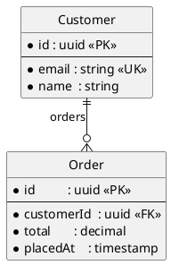
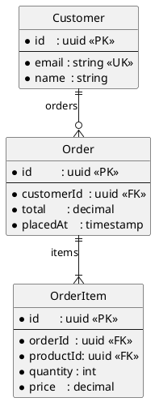

# ERD / Database Design

Owns the **data layer** of the shared design model defined by the [`design-model`](../design-model/SKILL.md) foundation skill. Reads and writes one section of one file:

- **Reads / writes**: `designs/system-model.yaml` → `entities[]`
- **Emits**: `designs/diagrams/erd.puml` (PlantUML ERD)
- **Emits (optional)**: `designs/diagrams/erd.ddl.sql` (generic ANSI-SQL CREATE statements, as design documentation)

This skill never executes SQL, never generates migrations, and never touches a live database. The DDL output is a design artifact a human can use as a starting point for a real migration written elsewhere.

## When to load this skill

- The user asks to add, edit, or visualise an entity, attribute, or relationship.
- The user mentions ERD, data model, database design, schema design, table design, or "how X relates to Y" in a domain context.
- A diagram of the data layer needs to be regenerated after a model change.
- An orphan-entity report is needed (entities no function reads or writes).

Load the [`design-model`](../design-model/SKILL.md) foundation skill alongside this one whenever the model file does not yet exist or its ID grammar is in question.

## Prerequisites

The generator script dynamic-imports the `yaml` package. If it is not available in the workspace, install it once:

```bash
pnpm add -D -w yaml
```

Or pass `--json` and a JSON model file — the same fallback used by the foundation validator.

## Workflow

### 1. Make sure the model file exists

If `designs/system-model.yaml` is missing, hand off to `design-model` to bootstrap it (it has the template and the validator). Do not invent a new file format here — every design skill shares the same file.

### 2. Add or edit entities

Walk the user through one entity at a time. For each:

1. **Name** — PascalCase, singular noun (`Customer`, `Order`, `LineItem`).
2. **ID** — `entity:<Name>`, optionally namespaced (`entity:billing/Invoice`).
3. **Description** — one short sentence on what the entity represents in the business.
4. **Attributes** — for each: name (camelCase), type, required, primary-key/foreign-key/unique markers.
5. **Relationships** — to which other entities, with cardinality and (optionally) role names.
6. **Indexes** (optional, design discussion only) — composite or partial indexes the architect wants on the table eventually.

Keep IDs stable. If a rename is genuinely needed, perform it as an explicit "rename `entity:Foo` to `entity:Bar`" step that updates every reference in the model and re-runs the validator.

### 3. Validate the model

```bash
node .agents/skills/design-model/scripts/validate.mjs designs/system-model.yaml
```

The foundation validator already covers ID uniqueness, ID grammar, and cross-reference resolution including foreign-key target attributes. Do not duplicate those checks here — fix any errors it reports before regenerating diagrams.

### 4. Regenerate the diagram

```bash
node .agents/skills/erd-design/scripts/generate.mjs designs/system-model.yaml
```

This **overwrites** `designs/diagrams/erd.puml`. Never hand-edit that file — every regeneration drops manual changes. If the user wants tweaks, capture them in the model (description fields, indexes, role names) and let the generator re-emit them.

To also emit the ANSI-SQL DDL design artifact:

```bash
node .agents/skills/erd-design/scripts/generate.mjs designs/system-model.yaml --ddl
```

### 5. Report orphan entities

After regeneration, list any entity that no function in the `functions[]` section reads or writes. The foundation validator already prints these as warnings; surface them again as a workflow step so the user can decide whether to delete them, hide them under `metadata.deprecated`, or add a function that consumes them.

## Entity object shape

```yaml
entities:
  - id: entity:Customer                 # required, must start with "entity:"
    name: Customer                      # required, display label
    description: A registered buyer.    # optional, one sentence
    namingNotes: >                      # optional, free text for the architect
      Stored as `customers` table; `email` is case-insensitive.
    attributes:                         # required, at least one
      - name: id                        # required, camelCase
        type: uuid                      # required, free string (uuid, string, int, decimal, …)
        required: true                  # optional, default false
        primaryKey: true                # optional, default false; only one per entity
        unique: true                    # optional, default false
        indexed: true                   # optional, default false
        foreignKey: entity:Other.attr   # optional, points at another entity's attribute
        default: now()                  # optional, free string
        description: Stable surrogate.  # optional, one sentence
    relationships:                      # optional list
      - to: entity:Order                # required, target entity ID
        cardinality: one-to-many        # required, see below
        optional: false                 # optional, default false
        roleNameSource: orders          # optional, label for the source side
        roleNameTarget: customer        # optional, label for the target side
        description: A customer places orders.   # optional
    indexes:                            # optional list, design discussion only
      - name: idx_orders_customer_placed
        on: [customerId, placedAt]
        unique: false
```

### Required vs optional

- **Required**: `id`, `name`, `attributes` (with at least one entry); each attribute needs `name` and `type`.
- **Optional**: every other field.

The foundation validator enforces ID grammar and foreign-key resolution; it does **not** enforce "at least one attribute" or "at most one primaryKey" — those are layer-specific. The generator script in this skill warns on both.

## Relationship object shape — cardinality vocabulary

`cardinality` is one of four values; combine with `optional` to express the full eight-way classic ERD matrix.

| `cardinality` | `optional: false` (rendered) | `optional: true` (rendered) |
|---|---|---|
| `one-to-one` | `\|\|--\|\|` | `\|\|--\|o` |
| `one-to-many` | `\|\|--\|{` | `\|\|--o{` |
| `many-to-one` | `}\|--\|\|` | `}o--\|\|` |
| `many-to-many` | `}\|--\|{` | `}o--o{` |

`optional` describes whether the **target** side may be absent. For `many-to-many` it applies to both sides symmetrically.

When in doubt about which way around to model the cardinality, follow the foreign key: the entity holding the foreign-key attribute is the "many" side. So `Order.customerId → entity:Customer.id` is `many-to-one` from `Order` to `Customer`.

## PlantUML ERD examples

### One-to-many (a customer places many orders)



### Many-to-one (an order belongs to one customer)

```plantuml
entity Customer { * id : uuid <<PK>> }
entity Order {
  * id         : uuid <<PK>>
  * customerId : uuid <<FK>>
}

Order }|--|| Customer : "customer"
```

The foreign key sits on the source side (`Order.customerId`), which is also why this is the canonical direction for declaring `many-to-one` in the model.

### One-to-one (a user has at most one profile)

```plantuml
entity User    { * id : uuid <<PK>> }
entity Profile {
  * id     : uuid <<PK>>
  * userId : uuid <<FK,UK>>
  bio      : string
}

User ||--|o Profile
```

### Many-to-many via a join entity

Always model many-to-many as two `one-to-many` relationships through an explicit join entity. Implicit M:N hides too much detail (composite keys, payload columns, audit fields).

```plantuml
entity Student   { * id : uuid <<PK>> }
entity Course    { * id : uuid <<PK>> }
entity Enrolment {
  * studentId : uuid <<PK,FK>>
  * courseId  : uuid <<PK,FK>>
  enrolledAt  : timestamp
}

Student ||--o{ Enrolment
Course  ||--o{ Enrolment
```

### A small worked example (3 entities)



`||--|{` (without an `o`) means the target side has at least one item — an `Order` with zero items is rejected by the design.

## Generator behaviour

`scripts/generate.mjs` reads `designs/system-model.yaml` and writes:

- `designs/diagrams/erd.puml` — always.
- `designs/diagrams/erd.ddl.sql` — only when `--ddl` is passed.

It also:

- Warns when an entity has no attributes, has no primary key, has multiple `primaryKey: true` markers on a non-join entity, or declares a relationship with an unknown cardinality. These are layer-specific gaps that complement (not duplicate) the foundation validator.
- Warns when a relationship's `to` field points at an entity ID that is not declared in the model, and skips that edge from the diagram. (Foundation validator catches this too as a hard error; the generator stays useful as a standalone command.)
- Lists orphan entities (no function reads or writes them) at the end of stdout.
- Prefixes the DDL file with a clear "DESIGN ARTIFACT — NOT A MIGRATION" header so it cannot be mistaken for a runnable migration.
- Exits non-zero on internal errors (unparseable YAML, missing entities section); zero on warnings.

Foreign-key target attribute existence (e.g. that `entity:Order.customerId` actually has an attribute named `id` on `entity:Customer`) is checked by the foundation validator — run `node .agents/skills/design-model/scripts/validate.mjs designs/system-model.yaml` for that.

To render the diagram to an image, install PlantUML separately and run `plantuml designs/diagrams/erd.puml` — diagram rendering is out of scope for this skill.

## Orphan-entity workflow

After regenerating, walk through each orphan entity with the user:

1. **Stale** — entity is no longer needed; remove it from the model.
2. **Read-only reference data** — entity is intentionally not written by code (e.g., country codes); add a function in `functions[]` that reads it (`reads: [entity:Country]`) so the trace is honest.
3. **About to be used** — feature is planned; mark with `description: "Planned for <feature>"` and accept the warning until the consumer is added.

Never silence the warning by adding a fake function — it would lie to every cross-layer trace the EA orchestrator produces later.

## Bundled files

```
.agents/skills/erd-design/
├── SKILL.md                 ← you are here
├── scripts/
│   └── generate.mjs         ← entities → PlantUML (+ optional ANSI-SQL DDL)
└── references/
    └── cardinality.md       ← long-form notes on the cardinality vocabulary
```
