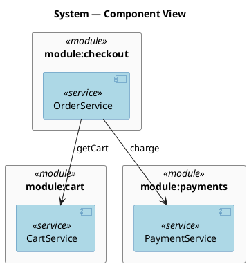
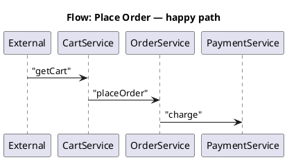

# System Design (Services, Functions, Sequence)

Owns the **application layer** of the shared design model defined by the [`design-model`](../design-model/SKILL.md) foundation skill. Reads and writes three sections of one file, and writes one component diagram plus one sequence diagram per flow:

- **Reads / writes**: `designs/system-model.yaml` → `services[]`, `functions[]`, `flows[]`
- **Emits**: `designs/diagrams/system-c4.puml` (one C4 component diagram for the whole system) and `designs/diagrams/seq-<flow-id>.puml` (one sequence diagram per flow).

This skill never generates source code, function bodies, OpenAPI specs, or runtime configuration. Function inputs/outputs are notational and live alongside the rest of the design.

## When to load this skill

- The user asks to add, edit, or visualise a service, function, or named cross-service flow.
- The user mentions C4, C4 component, system architecture, service map, function map, sequence diagram, or asks to "show how the services call each other".
- A C4 or sequence diagram needs to be regenerated after a model change.
- A cross-link report is needed (orphan services, orphan functions, function/service mismatches).

Load the [`design-model`](../design-model/SKILL.md) foundation skill alongside this one whenever the model file does not yet exist or its ID grammar is in question. Load [`bpmn-design`](../bpmn-design/SKILL.md) when a flow is the system-layer view of a business process whose tasks already live in `processes[]`.

## Prerequisites

The generator script dynamic-imports the `yaml` package. If it is not available in the workspace:

```bash
pnpm add -D -w yaml
```

Or pass `--json` and a JSON model file — the same fallback used by the foundation validator and the sibling generators.

## Workflow

### 1. Make sure the model file exists

If `designs/system-model.yaml` is missing, hand off to `design-model` to bootstrap it. Do not invent a new file format.

### 2. Add or edit a service

Walk the user through one service at a time:

1. **Service name** — short noun phrase (`OrderService`, `PaymentService`, `NotificationService`).
2. **ID** — `service:<PascalCase>` matching the name. PascalCase is enforced by the foundation validator.
3. **Owning module** — `module:<id>` from the code-structure layer (defaults to `module:tbd` while modules haven't been declared yet).
4. **Exposed functions** — list of `function:ServiceName.methodName` IDs the service publishes. Every entry must appear later in `functions[]`.
5. **Consumed functions** — list of `function:OtherService.methodName` IDs the service calls outbound. Drives the arrows in the C4 diagram.
6. **Description** — one sentence on the service's responsibility.

### 3. Add or edit a function

Walk the user through one function at a time:

1. **Name and ID** — `function:<ServiceName>.<methodName>` (PascalCase service, camelCase method, exactly one dot — the foundation validator rejects anything else).
2. **Owning service** — `service:<id>`. The generator warns if the service does not also list this function in its `exposes[]`.
3. **Inputs / outputs** — free-form list of `{ name, type }` pairs. Types are notational (`uuid`, `string`, `Array<{...}>`, `Money` — anything readable). The skill does not type-check them.
4. **Reads / writes** — lists of `entity:<id>` IDs from the data layer. Surfaces in the C4 diagram as data-affinity hints (currently only enumerated in the textual report; see *Out of scope*).
5. **Flow membership** — list of `flow:<id>` IDs this function participates in. The same flow membership is restated symmetrically in `flows[].sequence[]` — both directions are validated.

### 4. Add or edit a flow

A flow is a named end-to-end path through the system. Walk the user through:

1. **Name and ID** — `flow:<kebab-case>` (`flow:place-order`, `flow:billing/refund`).
2. **Owning process** — `process:<id>` linking the flow to the BPMN layer (one process can have many flows: happy path, error path, etc.).
3. **Description** — one sentence on what end-to-end behaviour the flow represents.
4. **Sequence** — ordered list of `function:Service.method` IDs invoked along the path. The generator turns this list into a PlantUML sequence diagram, drawing one participant per service touched.

### 5. Validate the model

```bash
node .agents/skills/design-model/scripts/validate.mjs designs/system-model.yaml
```

The foundation validator covers:

- ID uniqueness and grammar (`service:` PascalCase, `function:` `Service.method`, `flow:` kebab).
- `services[].module` resolves to a `module:`.
- `services[].exposes[]` and `services[].consumes[]` resolve to `function:` IDs.
- `functions[].service` resolves to a `service:`.
- `functions[].reads[]` / `functions[].writes[]` resolve to `entity:` IDs.
- `functions[].flows[]` resolves to `flow:` IDs.
- `flows[].process` resolves to a `process:`.
- `flows[].sequence[]` resolves to `function:` IDs.

Fix any errors it reports before regenerating.

### 6. Regenerate the diagrams

```bash
node .agents/skills/system-design/scripts/generate.mjs designs/system-model.yaml
```

Always overwrites — never hand-edit `system-c4.puml` or `seq-*.puml`. To regenerate just one flow:

```bash
node .agents/skills/system-design/scripts/generate.mjs designs/system-model.yaml --flow flow:place-order
```

`--flow` skips the C4 component diagram and writes only the named flow's sequence diagram. Use it for tight iteration on a single flow.

### 7. Read the validation report

After generation the script prints:

- A one-line C4 summary: `system-c4 — N services in M modules · K function-call edges`.
- A one-line summary per flow: `flow:<id> — N participants · N steps · spans M services / K modules`.
- **Orphan services**: services with empty `exposes[]` AND empty `consumes[]` AND not referenced as the callee of any other service's `consumes[]` AND not appearing in any flow's sequence.
- **Orphan functions**: functions not in any flow AND not exposed by any service.
- **Function/service mismatch**: `function.service` declares `service:A` but `service:A.exposes[]` does not list the function (or `service:A` does not exist).
- **Cross-module flows**: flows whose `sequence[]` touches services in more than one module — informational, not necessarily wrong (real flows often cross modules), but useful for the architect to see at a glance.
- **BPMN cross-link**: `processes[].tasks[].implementedBy[]` references that point at unknown function IDs are caught by the foundation validator and not duplicated here.

The script exits 0 on warnings; non-zero only on internal failures (unparseable file, missing required sections).

## Object shapes

```yaml
services:
  - id: service:OrderService          # required, "service:<PascalCase>"
    name: OrderService                # required
    module: module:checkout           # required, → module
    description: Owns the order lifecycle.   # optional
    exposes:                          # optional, → function[]
      - function:OrderService.placeOrder
      - function:OrderService.cancelOrder
    consumes:                         # optional, → function[]
      - function:CartService.getCart
      - function:PaymentService.charge

functions:
  - id: function:OrderService.placeOrder    # required, "function:<Service>.<method>"
    name: placeOrder                        # required
    service: service:OrderService           # required, → service
    description: Validate the cart and write a new order.  # optional
    inputs:                                 # optional, free-form
      - { name: customerId, type: uuid }
      - { name: items,      type: "Array<{productId, quantity}>" }
    outputs:                                # optional, free-form
      - { name: orderId, type: uuid }
    reads:  [entity:Customer, entity:CartItem]   # optional, → entity[]
    writes: [entity:Order]                       # optional, → entity[]
    flows:  [flow:place-order-happy-path]        # optional, → flow[]

flows:
  - id: flow:place-order-happy-path     # required, "flow:<kebab>"
    name: Place Order — happy path      # required
    process: process:place-order        # required, → process
    description: Cart entered, order persisted, no failures.   # optional
    sequence:                           # required, → function[] (ordered)
      - function:CartService.getCart
      - function:OrderService.placeOrder
      - function:PaymentService.charge
```

### Required vs optional

- **service**: `id`, `name`, `module` required; `exposes`, `consumes`, `description` optional.
- **function**: `id`, `name`, `service` required; everything else optional.
- **flow**: `id`, `name`, `process`, `sequence` required; `description` optional. Empty `sequence[]` is a modelling smell — declare the flow only when you can list at least one function.

## PlantUML examples

### C4 component diagram (the whole system)

The generator emits a single PlantUML component diagram. It uses native `rectangle` / `component` syntax — no external `!include` URLs, no network at render time, so it renders offline and on any PlantUML installation.



The arrow label is the **method name** of every consumed function the caller declares. When a single caller consumes multiple functions on the same callee, the labels are joined by `\n` so the edge stays visually unambiguous.

### Sequence diagram per flow



Convention the generator applies:

- The first function's caller is `External` (an actor representing the world outside the modelled services — the user, an upstream API, a scheduler).
- Subsequent calls are drawn from the previous step's owning service to the next function's owning service.
- When consecutive sequence entries belong to the **same** service, the call renders as a self-loop on that service.
- Arrow labels are the **method name** of the called function (PlantUML's right-hand side after `:`).

### Async vs sync arrows (documentation only)

PlantUML sequence diagrams support several arrow styles:

```plantuml
A -> B  : "synchronous call (default — what this skill emits)"
A ->> B : "asynchronous dispatch (open arrowhead)"
A --> B : "return value (dashed)"
A --x B : "lost message"
```

The v1 schema for `flows[].sequence[]` carries only the function ID, so the generator emits sync arrows everywhere. Returns and async dispatches are not modelled. If you need them, model the same business outcome as two separate flows (e.g., `flow:place-order-fire-and-forget` for the async path) and document the asynchrony in the flow's `description`.

### Cross-service note

```plantuml
note over svc_OrderService, svc_PaymentService
  Idempotency key: order.id
end note
```

Notes are not generated automatically — they are a tool for a human reviewing the rendered diagram. Add them to the discussion, not to the file (the generator overwrites it on every run).

## Generator behaviour

`scripts/generate.mjs` reads `designs/system-model.yaml` and writes:

- `designs/diagrams/system-c4.puml` — one component diagram for every service grouped by module, with one labelled arrow per `services[].consumes[]` entry. Multiple consumed functions from the same caller to the same callee collapse into one arrow with a multi-line label.
- `designs/diagrams/seq-<slug>.puml` — one sequence diagram per flow. `<slug>` is the flow ID with the `flow:` prefix removed and `/` replaced with `_`.

It also:

- Prints a per-flow summary line: `<flow-id> — N participants · N steps · spans M services / K modules`.
- Prints a C4 summary: `system-c4 — N services in M modules · K function-call edges`.
- Warns about orphan services, orphan functions, function/service mismatches, cross-module flows, and flows whose first sequence entry is not exposed by any service (a likely modelling error).
- Skips edges whose endpoints don't resolve (foundation validator hard-fails on these; this script stays useful when you want to regenerate a partially-edited model).
- Exits non-zero only on internal failures (unparseable YAML, missing `services[]`/`functions[]`/`flows[]` sections); zero on warnings.

## Bundled files

```
.agents/skills/system-design/
├── SKILL.md                 ← you are here
├── scripts/
│   └── generate.mjs         ← services + functions + flows → C4 + sequence diagrams
└── references/
    └── c4-and-sequence.md   ← long-form notes on C4 component conventions and sequence-diagram semantics
```
