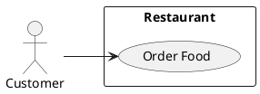
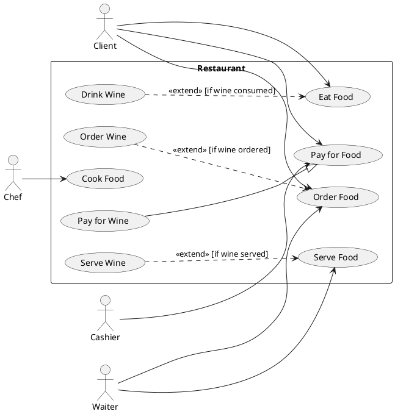

# Use Case Design

Owns the **use-case layer** of the shared design model defined by the [`design-model`](../design-model/SKILL.md) foundation skill. Reads and writes one section of one file, and writes one diagram per system boundary:

- **Reads / writes**: `designs/system-model.yaml` → `usecases[]`
- **Emits**: `designs/diagrams/usecase-<system>.puml` (one PlantUML file per `system` boundary), or `designs/diagrams/usecases.puml` when no use case declares a `system`.

This skill never generates code, never produces user stories or acceptance criteria, and never replaces process modelling. Use cases capture **what** the system delivers to its actors at goal level; the BPMN layer captures **how** the work flows step-by-step inside the organisation; the (planned) user-story layer captures the agile-style increments that deliver each use case.

## When to load this skill

- The user asks to add, edit, or visualise a use case, an actor's goals, or a system boundary picture.
- The user mentions "use case", "use-case diagram", "UML use case", "actor diagram", "system boundary", "include / extend relationship", "use case generalization", or asks "what can <actor> do in the system?".
- A diagram of one system's use cases needs to be regenerated after a model change.
- A cross-link report is needed (use cases with no actor, isolated use cases not reachable through include / extend / generalization).

Load the [`design-model`](../design-model/SKILL.md) foundation skill alongside this one whenever the model file does not yet exist or its ID grammar is in question. When the user wants to drill into how the steps of a use case actually flow across roles and systems, hand off to [`bpmn-design`](../bpmn-design/SKILL.md).

## Use case vs BPMN process — pick the right layer

| Concern | Use case (this skill) | BPMN process (`bpmn-design`) |
|---|---|---|
| Question it answers | What goal does an actor achieve through the system? | How does the work flow step-by-step across roles and systems? |
| Granularity | One goal per use case (a few words). | One task per BPMN task (verb phrase). |
| Notation | UML use case (actor → ellipse, `<<include>>`, `<<extend>>`, generalization). | BPMN swimlanes, gateways, sequence flows. |
| Audience | Stakeholders agreeing on scope. | Process owners agreeing on operations. |
| Inside a sprint | Use cases come first to scope an iteration. | BPMN diagrams come next to design the work. |

Both layers can — and usually should — point at the same actors, the same services, and the same functions. They model different aspects of the same system, not competing models of the same aspect.

## Prerequisites

The generator script dynamic-imports the `yaml` package. If it is not available in the workspace:

```bash
pnpm add -D -w yaml
```

Or pass `--json` and a JSON model file — the same fallback used by the foundation validator and the other generators.

## Workflow

### 1. Make sure the model file exists

If `designs/system-model.yaml` is missing, hand off to `design-model` to bootstrap it. Do not invent a new file format.

### 2. Add or edit a use case

Walk the user through one use case at a time:

1. **Use case name** — short verb phrase from the actor's perspective (`Order Food`, `Pay for Food`, `Cook Food`). Avoid system-internal phrasing ("Submit POST /orders").
2. **ID** — `usecase:<kebab-case>`. Stable across renames; the diagram is regenerated from this.
3. **Description** — one sentence on the goal the actor achieves.
4. **System boundary** (optional but recommended) — the `system` field is a free-text label that groups related use cases on the same diagram. One file is emitted per distinct `system` value. Use `restaurant`, `pos`, `mobile-app`, etc. Use cases with no `system` are gathered into `usecases.puml`.
5. **Actors** — `actors[]` lists the `actor:` IDs that participate. The first actor in the list is treated as the **primary actor** (rendered on the left of the boundary); the rest are supporting actors (rendered on the right). At least one actor is required.
6. **Include relationships** — `include[]` lists the `usecase:` IDs this use case **always** invokes as part of completing its goal (`<<include>>` arrows point from the including use case to the included one). Use this when a sub-goal is mandatory and reusable across multiple parent use cases.
7. **Extend relationships** — `extend[]` lists the `usecase:` IDs that this use case **optionally** extends, each with an optional `condition` string rendered in brackets on the arrow. The arrow points from the extending use case to the base use case (matches UML semantics: `<<extend>>` arrows leave the optional behaviour and point at the base case it inserts into).
8. **Generalization** — optional `generalizationOf` field names a parent use case (`usecase:`) that this one is a specialization of. Drawn as a UML generalization arrow from this use case to the parent (open triangle on the parent end).

Keep IDs stable. Renaming a use case ID requires updating every `include`, `extend`, and `generalizationOf` reference; the foundation validator catches dangling references.

### 3. Validate the model

```bash
node .agents/skills/design-model/scripts/validate.mjs designs/system-model.yaml
```

The foundation validator covers:

- ID uniqueness and grammar (every `usecase:` ID is unique and matches `[a-z][a-z0-9-]*`).
- `usecases[].actors[]` references resolve to declared `actor:` IDs.
- `usecases[].include[]`, `usecases[].extend[].usecase`, and `usecases[].generalizationOf` references resolve to declared `usecase:` IDs.

Fix any errors it reports before regenerating.

### 4. Regenerate the diagram(s)

```bash
node .agents/skills/use-case-design/scripts/generate.mjs designs/system-model.yaml
```

The generator writes one file per distinct `system` value, plus `usecases.puml` if any use case has no `system`. It always overwrites — never hand-edit `usecase-*.puml` files. Tweaks belong in the model (rename, regroup, add description) and the generator re-emits them.

To regenerate just one boundary:

```bash
node .agents/skills/use-case-design/scripts/generate.mjs designs/system-model.yaml --system restaurant
```

### 5. Read the validation report

After generation the script prints, per system boundary:

- A one-line summary: `restaurant — 4 actors · 6 use cases · 2 includes · 3 extends · 1 generalization`.
- Use cases with no actor (a use case without a primary actor is a modelling smell).
- Use cases that are completely isolated — no actor reaches them and no other use case includes, extends, or generalizes them. Often a stale leftover from earlier modelling.
- Generalization cycles (e.g. `usecase:a` declares `generalizationOf: usecase:b` and `usecase:b` declares `generalizationOf: usecase:a`).
- Self-references in `include[]`, `extend[]`, or `generalizationOf` (always a mistake).

Other foundation-layer issues (ID grammar, wrong-kind references, dangling actor or use case IDs) are reported by the foundation validator, not duplicated here.

## Use case object shape

```yaml
usecases:
  - id: usecase:order-food                      # required, must start with "usecase:"
    name: Order Food                            # required, display label
    description: Customer orders food.          # optional, one sentence
    system: restaurant                          # optional; groups use cases per diagram

    actors:                                     # required, at least one
      - actor:Client                            # primary actor (rendered on the left)
      - actor:Waiter                            # supporting actors (rendered on the right)

    include:                                    # optional list of usecase: IDs
      - usecase:select-menu-items               # always invoked; <<include>> arrow

    extend:                                     # optional list of {usecase, condition?}
      - usecase: usecase:order-wine             # base use case being extended
        condition: "if wine ordered"            # rendered in brackets on the arrow

    generalizationOf: usecase:order             # optional; this use case is a child of usecase:order
```

### Required vs optional

- **Required**: `id`, `name`, at least one entry in `actors[]`.
- **Optional**: `description`, `system`, `include[]`, `extend[]`, `generalizationOf`.

The foundation validator enforces ID grammar and cross-reference resolution. Layer-specific checks (at least one actor, no self-references, no generalization cycles, isolation report) are reported by this skill's generator as warnings.

## Relationship semantics — quick reference

| Relationship | Field | Direction | Meaning |
|---|---|---|---|
| Association | `actors[]` | Actor → use case | Actor participates in the use case. |
| Include | `include[]` on the parent | Parent → child, `<<include>>` | Parent **always** invokes the child as part of completing its goal. |
| Extend | `extend[]` on the extension | Extension → base, `<<extend>>` | Extension **optionally** inserts behaviour into the base, gated by `condition`. |
| Generalization | `generalizationOf` on the child | Child → parent (open triangle) | Child is a more specific kind of the parent; inherits its actor associations and behaviour. |

Two common mistakes to avoid:

- **`<<include>>` pointing the wrong way.** It is the *parent* (the one that includes the sub-goal) that owns the arrow. If "Order Food" always involves "Select Menu Items", then `usecase:order-food` declares `include: [usecase:select-menu-items]`, not the other way round.
- **`<<extend>>` declared on the base.** It is the *extension* (the optional behaviour) that owns the arrow and the condition. "Order Wine" extends "Order Food" with the condition "if wine ordered" — declared on `usecase:order-wine`, not on `usecase:order-food`.

## PlantUML use-case examples

PlantUML has first-class support for use case diagrams. Output renders in any PlantUML installation, GitHub-flavoured Markdown that supports PlantUML, and VS Code PlantUML extensions.

### Single actor, single use case



### `<<include>>` — mandatory sub-goal

```plantuml
usecase "Order Food"        as uc_order_food
usecase "Select Menu Items" as uc_select_menu_items
uc_order_food ..> uc_select_menu_items : <<include>>
```

The arrow always points from the *including* use case to the *included* one. Use this when a sub-goal is reusable across multiple parents (e.g. "Authenticate User" is included by every checkout-related use case).

### `<<extend>>` — optional behaviour

```plantuml
usecase "Order Food" as uc_order_food
usecase "Order Wine" as uc_order_wine
uc_order_wine ..> uc_order_food : <<extend>> [if wine ordered]
```

The arrow points from the *extending* (optional) use case to the *base* one. The bracketed condition is rendered on the arrow and explains when the extension fires.

### Generalization — "Pay for Wine" is a kind of "Pay for Food"

```plantuml
usecase "Pay for Food" as uc_pay_for_food
usecase "Pay for Wine" as uc_pay_for_wine
uc_pay_for_wine --|> uc_pay_for_food
```

The open triangle (`--|>`) sits on the parent end. The child inherits the parent's actor associations.

### Multi-actor restaurant scenario



This is the diagram a typical "actors and goals" workshop produces; it intentionally stays at goal level and leaves step-by-step flow to BPMN.

## Generator behaviour

`scripts/generate.mjs` reads `designs/system-model.yaml` and writes one file per distinct `system` value to `designs/diagrams/usecase-<slug>.puml`, where `<slug>` is the system label slugified (lowercased, non-alphanumerics replaced with `-`). Use cases with no `system` field are emitted into `designs/diagrams/usecases.puml`.

It also:

- Prints a per-boundary summary line: `<system> — N actors · N use cases · N includes · N extends · N generalizations`.
- Warns if a use case has no actors (every use case needs at least one association).
- Warns if a use case is isolated (no actor association, not included by anything, not extended by anything, not the parent of any specialization).
- Warns on self-references (`include[]`, `extend[].usecase`, or `generalizationOf` pointing at the same `usecase:` ID).
- Warns on generalization cycles via `generalizationOf`.
- Skips `include`, `extend`, and `generalizationOf` entries pointing at unknown IDs with a warning (foundation validator hard-fails on these; this script stays useful for standalone runs).
- Runs the foundation validator first; exits **1** if it reports any grammar or cross-reference errors. Exits **2** on internal failures (file unreadable, parse error). An empty or absent `usecases[]` section exits cleanly with a no-op message.

## Bundled files

```
.agents/skills/use-case-design/
├── SKILL.md                        ← you are here
├── scripts/
│   └── generate.mjs                ← usecases[] → one PlantUML file per system boundary
└── references/
    └── usecase-uml-notation.md     ← long-form notes on UML use case notation
```
